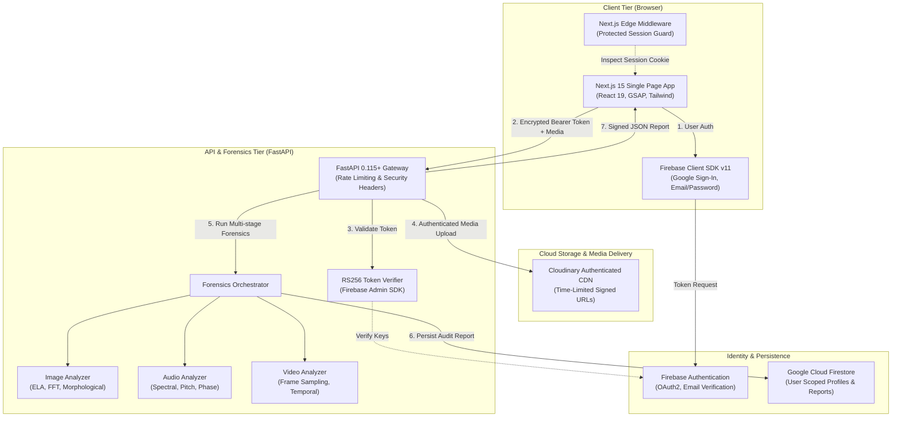

# OmniFace v2.0 — Multimodal Deepfake & Synthetic Media Forensics

<div align="center">


**Enterprise-grade multimodal forensic platform for AI-generated and manipulated media detection.**  
*Combines spatial, temporal, frequency, and biometric signals across Images, Video, and Audio.*

[](https://nextjs.org/)
[](https://react.dev/)
[](https://www.typescriptlang.org/)
[](https://fastapi.tiangolo.com/)
[](https://www.python.org/)
[](https://firebase.google.com/)
[](https://cloudinary.com/)
[](https://docs.pytest.org/)

</div>

---

## 📌 Table of Contents

- [Overview](#-overview)
- [System Architecture](#-system-architecture)
- [Key Features](#-key-features)
- [Repository Structure](#-repository-structure)
- [Tech Stack](#-tech-stack)
- [Getting Started (Local Development)](#-getting-started-local-development)
  - [Prerequisites](#prerequisites)
  - [Backend Setup](#1-backend-setup-fastapi)
  - [Frontend Setup](#2-frontend-setup-nextjs)
- [Environment Variables](#-environment-variables)
- [Testing & Quality Assurance](#-testing--quality-assurance)
- [Production Deployment](#-production-deployment)
  - [Frontend (Vercel / Netlify)](#frontend-deployment-vercel--netlify)
  - [Backend (Render / Railway / Docker)](#backend-deployment-render--railway--docker)
  - [Pre-Deployment Checklist](#pre-deployment-checklist)
- [Security & Compliance](#-security--compliance)
- [Contributing & License](#-contributing--license)

---

## 🔬 Overview

**OmniFace v2.0** is an end-to-end deepfake detection and synthetic media forensics workstation. It inspects digital artifacts across multiple modalities to determine whether media is authentic, AI-generated, or tampered with.

### Primary Modalities Analyzed:
1. **Images (`image/*`)**: Spatial pixel discontinuities, frequency spectrum anomalies (FFT), Error Level Analysis (ELA), warping artifacts, blending boundaries, and EXIF consistency.
2. **Audio (`audio/*`)**: Spectral consistency, pitch contour irregularities, phase coherence, voice cloning synthesis artifacts, and unnatural pause distributions.
3. **Video (`video/*`)**: Multi-frame sampling, temporal landmark flicker, lip-sync mismatch, optical flow inconsistency, and face-swap boundary seams.

---

## 🏗️ System Architecture



---

## ✨ Key Features

- **🛡️ Enterprise Authentication**:
  - **Firebase Auth v11**: Official modular integration supporting Email/Password and Google Sign-In.
  - **Email Verification Guard**: Requires users to verify their email before granting platform workspace access.
  - **Self-Service Password Reset**: Direct integration with Firebase `sendPasswordResetEmail()` reusing the unified login interface.
  - **Consistent Session Management**: Global multi-surface logout (Settings, Profile, Mobile Menu) redirected to landing page with cookie invalidation.
- **🔍 Deep Forensic Analysis**:
  - **Confidence Metrics**: Granular percentage probability verdict (`Authentic`, `Likely Authentic`, `Suspicious`, `Deepfake Detected`).
  - **Multi-signal Breakdown**: Score transparency with visual heatmaps, frequency plots, and anomaly flags.
  - **Tamper Evidence**: Cryptographic SHA-256 fingerprinting on raw uploaded file bytes to prevent chain-of-custody contamination.
- **⚡ Interactive Dashboard**:
  - **Real-Time Analysis View**: Drag-and-drop file ingestion with live progress status.
  - **Forensic History & Search**: Filter past reports by modality, verdict, or date with local cache fallback.
  - **Exportable Reports**: Generate detailed PDF/JSON audit records for forensic documentation.
- **🔒 Hardened Security Baseline**:
  - **Strict CORS Policy**: Restricted origins in production with automatic development preflight fallback.
  - **HTTP Security Headers**: HSTS, `X-Content-Type-Options: nosniff`, `X-Frame-Options: DENY`, `Referrer-Policy`.
  - **MIME & Magic Bytes Verification**: Validates actual binary magic bytes to block file extension spoofing.
  - **Fail-Closed Architecture**: ML pipelines fail safely when required models or credentials are unavailable.

---

## 📂 Repository Structure

```text
Omniface version 2.0/
├── Backend/
│   ├── backend/
│   │   ├── app/
│   │   │   ├── analyzers/          # Image, audio, video forensic algorithms
│   │   │   ├── core/               # Config, Firebase Admin, Cloudinary, Dependencies
│   │   │   ├── models/             # Pydantic validation schemas & responses
│   │   │   ├── routers/            # API endpoints: analyze, auth, jobs, reports
│   │   │   └── main.py             # FastAPI entrypoint, middleware, health check
│   │   ├── tests/                  # Pytest unit & integration test suite (94 tests)
│   │   ├── .env.example            # Backend environment template
│   │   ├── Dockerfile              # Production multi-stage Docker container
│   │   ├── pytest.ini              # Pytest configuration
│   │   └── requirements.txt        # Python dependency manifest
│   ├── run.ps1 / run.sh            # Local convenience runners
│   └── EXECUTION_COMMANDS.md       # Developer execution notes
├── Frontend/
│   └── omniface-__-multimodal-deepfake-forensics/
│       ├── app/                    # Next.js 15 App Router (pages & layouts)
│       │   ├── dashboard/          # Workspace: analyze, history, reports, settings
│       │   ├── login/              # Login screen with Forgot Password
│       │   ├── register/           # Registration screen with email verification
│       │   └── layout.tsx          # Root layout & font definitions
│       ├── components/             # Reusable UI widgets & interactive sections
│       ├── lib/
│       │   ├── api/                # API client services (analysis, auth, history)
│       │   └── firebase.ts         # Client Firebase App & Auth SDK initialization
│       ├── middleware.ts           # Edge authentication route guarding
│       ├── next.config.ts          # Next.js standalone build & security headers
│       ├── package.json            # Node.js dependencies & build scripts
│       └── .env.example            # Frontend environment template
├── .gitignore                      # Global secret & artifact exclusion rules
├── DEPLOYMENT.md                   # Step-by-step production hosting manual
├── PRODUCTION_READINESS.md         # DevSecOps security audit report
└── README.md                       # Main documentation (this file)
```

---

## 💻 Tech Stack

| Domain | Technology | Version | Purpose |
| :--- | :--- | :--- | :--- |
| **Frontend Framework** | [Next.js](https://nextjs.org/) | `15.5+` | Server/client component architecture & static pre-rendering |
| **UI Library** | [React](https://react.dev/) | `19.2+` | Declarative UI components & transitions |
| **Language** | [TypeScript](https://www.typescriptlang.org/) | `5.9+` | Full static type safety across frontend |
| **Styling & Motion** | Tailwind CSS / GSAP | `v4` / `3.15` | GPU-accelerated scrubbed animations & styling |
| **Backend Framework** | [FastAPI](https://fastapi.tiangolo.com/) | `0.115+` | High-performance asynchronous REST API |
| **Python Runtime** | Python | `3.11` / `3.13` | Scientific computing & async request handling |
| **Validation** | [Pydantic](https://docs.pydantic.dev/) | `2.7+` | Request parsing & schema enforcement |
| **Auth & Security** | Firebase Auth / Admin | `v11` / `v6.5` | RS256 token verification & user management |
| **Cloud Storage** | Cloudinary | `1.40+` | Authenticated media upload & signed transformations |
| **Media Analysis** | OpenCV, Pillow, SoundFile | Latest | Computer vision, spatial analysis, signal spectrograms |
| **Testing** | Pytest, TestClient | `8.2+` | Unit & end-to-end integration validation |

---

## 🚀 Getting Started (Local Development)

### Prerequisites
- **Node.js**: `v20.x` or `v22.x` LTS
- **Python**: `3.11` or higher
- **npm** or **bun**
- **Git**

---

### 1. Backend Setup (FastAPI)

1. Open a terminal and navigate to the backend directory:
   ```bash
   cd "Backend/backend"
   ```

2. Create and activate a Python virtual environment:
   ```bash
   # Windows (PowerShell)
   python -m venv venv
   .\venv\Scripts\Activate.ps1

   # Linux / macOS
   python3 -m venv venv
   source venv/bin/activate
   ```

3. Install dependencies:
   ```bash
   pip install --upgrade pip
   pip install -r requirements.txt
   ```

4. Configure your environment variables:
   ```bash
   cp .env.example .env
   ```
   *Edit `.env` with your Firebase service account and Cloudinary credentials (see [Environment Variables](#-environment-variables)).*

5. Launch the backend API server:
   ```bash
   python -m uvicorn app.main:app --reload --host 127.0.0.1 --port 8000
   ```
   *The API will be available at `http://127.0.0.1:8000`. In development mode, interactive docs are at `http://127.0.0.1:8000/docs`.*

---

### 2. Frontend Setup (Next.js)

1. Open a second terminal and navigate to the frontend directory:
   ```bash
   cd "Frontend/omniface-__-multimodal-deepfake-forensics"
   ```

2. Install Node packages:
   ```bash
   npm install
   ```

3. Configure your local environment:
   ```bash
   cp .env.example .env.local
   ```
   *Fill in your Firebase client config parameters.*

4. Launch the Next.js development server:
   ```bash
   npm run dev
   ```
   *Access the web application at `http://localhost:3000`.*

---

## 🔐 Environment Variables

### Frontend (`.env.local`)
| Variable | Description | Example / Default |
| :--- | :--- | :--- |
| `NEXT_PUBLIC_API_URL` | Base URL of the FastAPI backend | `http://127.0.0.1:8000` (no trailing slash) |
| `NEXT_PUBLIC_APP_NAME` | Public branding name | `OmniFace Deepfake Forensics` |
| `NEXT_PUBLIC_MAX_UPLOAD_MB` | Client-side file size guard | `100` |
| `NEXT_PUBLIC_FIREBASE_API_KEY` | Firebase Client Web API Key | `AIzaSy...` |
| `NEXT_PUBLIC_FIREBASE_AUTH_DOMAIN` | Firebase Auth Domain | `your-app.firebaseapp.com` |
| `NEXT_PUBLIC_FIREBASE_PROJECT_ID` | Firebase Project ID | `your-project-id` |
| `NEXT_PUBLIC_FIREBASE_STORAGE_BUCKET`| Firebase Storage Bucket | `your-project-id.appspot.com` |
| `NEXT_PUBLIC_FIREBASE_MESSAGING_SENDER_ID`| Firebase Messaging Sender ID | `123456789012` |
| `NEXT_PUBLIC_FIREBASE_APP_ID` | Firebase Web App ID | `1:123456789012:web:...` |

### Backend (`.env`)
| Variable | Description | Example / Default |
| :--- | :--- | :--- |
| `ENVIRONMENT` | Target environment mode | `development` (local) or `production` |
| `DEBUG` | Enable debug logging | `False` in production |
| `REQUIRE_AUTH` | Enforce Firebase JWT token checks | `True` (recommended) or `False` (dev test only) |
| `FIREBASE_SERVICE_ACCOUNT_PATH` | Path to service account JSON file **OR raw inline JSON string** | `/path/to/key.json` or `{"type":"service_account",...}` |
| `CLOUDINARY_CLOUD_NAME` | Cloudinary account name | `your_cloud_name` |
| `CLOUDINARY_API_KEY` | Cloudinary API Key | `your_api_key` |
| `CLOUDINARY_API_SECRET` | Cloudinary API Secret | `your_api_secret` |
| `CORS_ORIGINS` | JSON array of permitted origins | `["http://localhost:3000","https://app.example.com"]` |
| `MAX_FILE_SIZE_MB` | Server maximum upload threshold | `100` |
| `ML_STUB_MODE` | Development pipeline stub mode | `True` (stub testing) or `False` (live checkpoints) |

---

## 🧪 Testing & Quality Assurance

### Run Frontend Production Verification:
```bash
cd "Frontend/omniface-__-multimodal-deepfake-forensics"

# Check static types
npx tsc --noEmit

# Run linter
npm run lint

# Compile optimized production build
npm run build
```

### Run Backend Test Suite:
```bash
cd "Backend/backend"

# Execute pytest with coverage
pytest
```
*Current test suite status: **94 passed out of 94 tests (100% pass rate)**.*

---

## 🌐 Production Deployment

The project is architected for independent, zero-friction deployment on modern serverless or container platforms.

### Frontend Deployment (Vercel / Netlify)
1. Link your GitHub repository.
2. Set **Root Directory** to: `Frontend/omniface-__-multimodal-deepfake-forensics`.
3. Set **Framework Preset** to: `Next.js`.
4. Enter the `NEXT_PUBLIC_*` environment variables in your platform dashboard.
5. Deploy. The standalone build trace is automatically generated.

### Backend Deployment (Render / Railway / Docker)
1. **Docker Container Deployment** (Recommended):
   ```bash
   cd Backend/backend
   docker build -t omniface-backend .
   docker run -p 8000:8000 --env-file .env omniface-backend
   ```
2. **Render / Railway Web Service**:
   - **Root Directory**: `Backend/backend`
   - **Build Command**: `pip install --upgrade pip && pip install -r requirements.txt`
   - **Start Command**: `uvicorn app.main:app --host 0.0.0.0 --port $PORT`
   - Set `FIREBASE_SERVICE_ACCOUNT_PATH` directly to the **raw JSON string** in the environment variable settings.

### Pre-Deployment Checklist
- [x] Frontend `npm run build` succeeds cleanly with zero errors.
- [x] Backend test suite passes 100% (`94 passed`).
- [ ] Backend deployed and live URL obtained (e.g., `https://omniface-api.onrender.com`).
- [ ] Frontend `NEXT_PUBLIC_API_URL` updated with production backend URL.
- [ ] Backend `CORS_ORIGINS` updated with the production frontend domain.
- [ ] Production frontend domain added to **Firebase Console → Authentication → Settings → Authorized domains**.

---

## 🛡️ Security & Compliance

- **Authentication Integrity**: Protected endpoints require cryptographically signed RS256 Firebase ID tokens validated via Google public keys.
- **Edge Boundary Guarding**: Edge Middleware prevents unauthenticated browsing of protected dashboard routes before any client-side bundle hydration.
- **Storage Isolation**: Media uploaded to Cloudinary is stored under authenticated folders and served via time-limited HMAC-signed URLs.
- **Data Protection**: Secrets, service accounts, and session tokens are strictly gitignored and excluded from client bundles.

---

## 📄 Contributing & Ethical Use

OmniFace is developed for digital media verification, journal integrity analysis, and synthetic media defense. 

1. Fork the repository
2. Create your feature branch (`git checkout -b feature/forensic-engine`)
3. Commit your changes (`git commit -m "Add new biometric consistency model"`)
4. Push to the branch (`git push origin feature/forensic-engine`)
5. Open a Pull Request

---

<div align="center">
  <sub>Built with ❤️ by the OmniFace Engineering Team. For questions or support, open an issue on GitHub.</sub>
</div>
